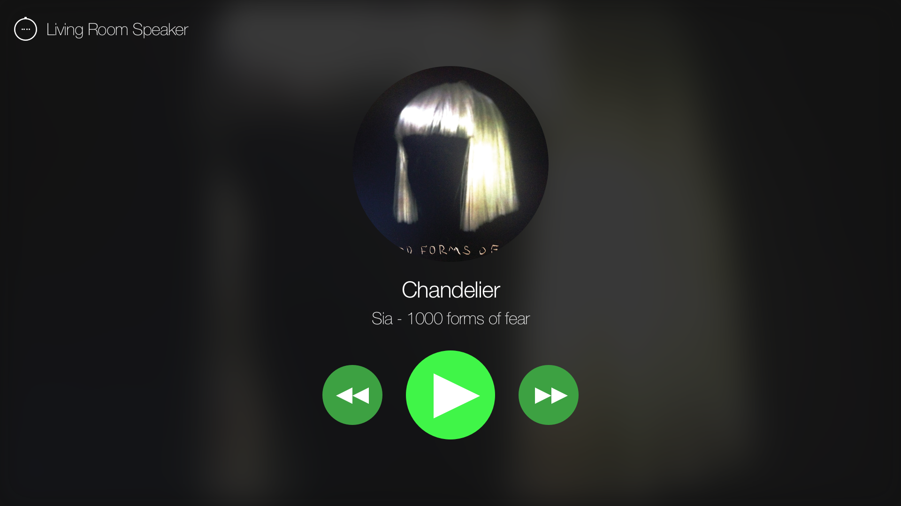

# 📺 Spotify App for tvOS
> A Spotify Connect App for personal use on Apple TV made with React Native

## What's That?
A Spotify application built with React Native which uses the Spotify Connect API. It allows you to view and control your Spotify session from your Apple TV:


[📽 See it in action](https://streamable.com/mxsg6)

It started as a personal project to test out React Native for tvOS. I really wanted a Spotify app for my Apple TV, and this is the result. I used Sketch to design it, and it is written in Typescript and tested with Jest and react-native-testing-library.

This project is free to use and modify, but bear in mind that Spotify is a commercial product and so this project is only meant for personal use.

The application is entirely custom made **and is in no way affiliated with Spotify**.

## Getting Started
### Prerequesits
* Knowledge of React Native
* Mac + XCode
* Create a Spotify app in the [Spotify Dashboard](https://developer.spotify.com/dashboard)

### Initializing the project
Clone this project to your machine by running:
```bash
git clone git@github.com:illBeRoy/spotify-tvos-app.git
```

Now install the required dependencies by running:
```bash
npm install
```

### Passing Tests
The next step is to make sure that everything works fine by passing the tests.
Start with creating a spotify configuration file (it does not exists in this repo as it contains personal configuration):

*src/api/spotify.config.ts*
```typescript
export default {
  CLIENT_AUTH: 'FOO',
  REFRESH_TOKEN: 'BAR'
};
```

We'll learn more about the config file in a minute, for now it can contain random values.

Next, run the following command:
```bash
npm test
```

If everything passes, we're good to go!

### Configuring The Project
The `spotify.config.ts` file contains two values:
* `CLIENT_AUTH`: your [Spotify app](https://developer.spotify.com/dashboard) client id and secret, formatted as: `<client_id>:<client_secret>` encoded in base64
* `REFRESH_TOKEN`: a refresh token for your own personal spotify **account** (not app), which can be used to produce access tokens.

The Spotify API client in the app uses the above to produce access tokens for your account, and that's how it can read and control your Spotify sessions. Read more about the authorization code flow [here](https://developer.spotify.com/documentation/general/guides/authorization-guide/#authorization-code-flow).

If you're not sure how to get your `REFRESH_TOKEN`, refer to Spotify's own [web-api-auth-examples](https://github.com/spotify/web-api-auth-examples). Do not forget to include the `user-read-playback-state` and `user-modify-playback-state` scopes when you generate your `REFRESH_TOKEN`.

### Running The Project
Finally! Now that everything is ready, simply run the following command:
```bash
npm start
```

If everything works correctly, this will start your React Native bundler and app inside a tvOS simulator.

### Deploying to Apple TV
If everything works fine and you're satisfied, you can install a working copy of the app on your Apple TV.

Start by opening XCode. Switch the build scheme to `spotify-tvOS-release`. The next thing to do is to connect your Mac to your Apple TV (via USB-C). You should be able to find your Apple TV device near the Build button in XCode.

Finally, press build and pray for the best. If everything works as expected, you'll see your new Spotify app on your Apple TV.

🎉 Congratulations!

## Disclaimer
As previously mentioned, this is a personal project and is in no way affiliate with Spotify.

Cloning, building, running and creating personal refresh tokens are under your exclusive responsibility.

Some of the icons used in the design are taken from [flaticon](https://flaticon.com).

Feel free to page me for anything! Enjoy!